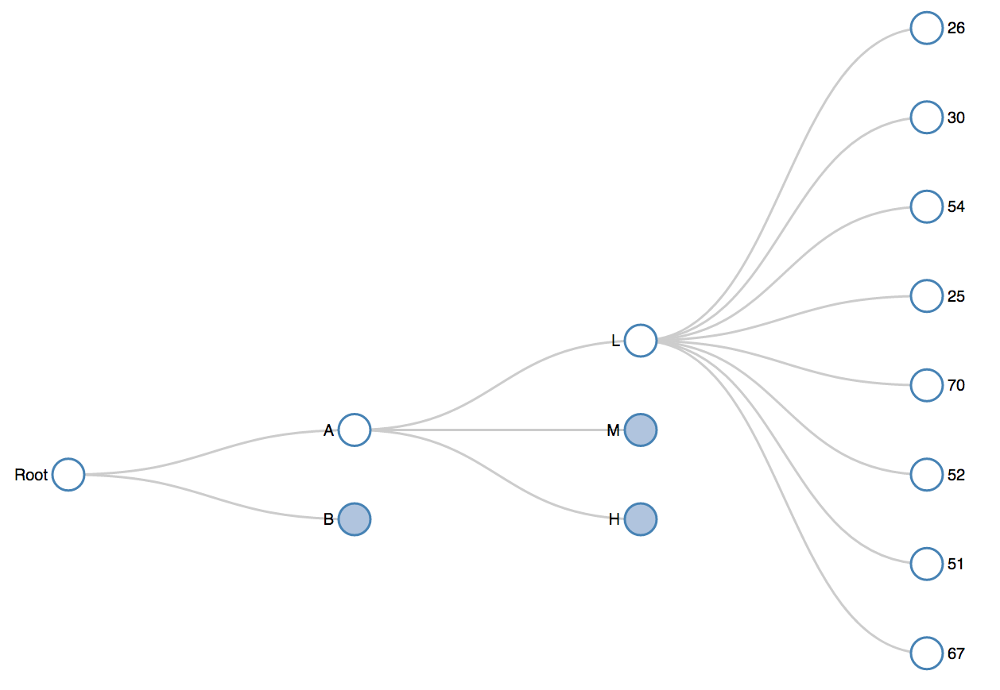

---
output:
  md_document:
    variant: markdown_github
---

<!-- README.md is generated from README.Rmd. Please edit that file -->

```{r, echo = FALSE}
knitr::opts_chunk$set(
  collapse = TRUE,
  comment = "#>",
  fig.path = "README-"
)
```

collapsibleTree is an R htmlwidget that allows you to create interactive collapsible Reingold–Tilford tree diagram using D3.js. Shiny interaction coming soon!




### Installation

```{r eval=FALSE}
devtools::install_github("AdeelK93/collapsibleTree")
```

```{r echo=FALSE, message=FALSE, warning=FALSE, error=FALSE}
options(width=120)
```

### Usage

```{r}
library(collapsibleTree)

# current verison
packageVersion("collapsibleTree")
```
